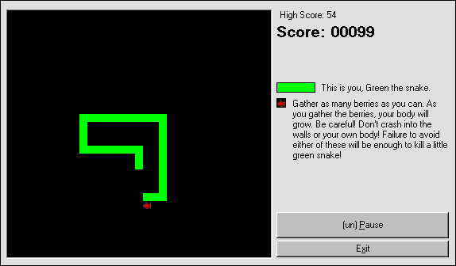



## One Word \.\.\. NIBBLES\!

### Description

A retro game for anyone who ever used QBasic :) the old Nibbles game is back again. Included is all the code, images, and the EXE. Sound is on its way.

----

-=[ PLEASE VOTE ]=-

----

 
### More Info
 

             |
---                |---
**Submitted On**   |2000-08-30 15:50:40
**By**             |[Sparq](https://github.com/Planet-Source-Code/PSCIndex/blob/master/ByAuthor/sparq.md)
**Level**          |Intermediate
**User Rating**    |4.2 (21 globes from 5 users)
**Compatibility**  |VB 6\.0
**Category**       |[Games](https://github.com/Planet-Source-Code/PSCIndex/blob/master/ByCategory/games__1-38.md)
**World**          |[Visual Basic](https://github.com/Planet-Source-Code/PSCIndex/blob/master/ByWorld/visual-basic.md)
**Archive File**   |[CODE\_UPLOAD94398302000\.zip](https://github.com/Planet-Source-Code/sparq-one-word-nibbles__1-11107/archive/master.zip)

